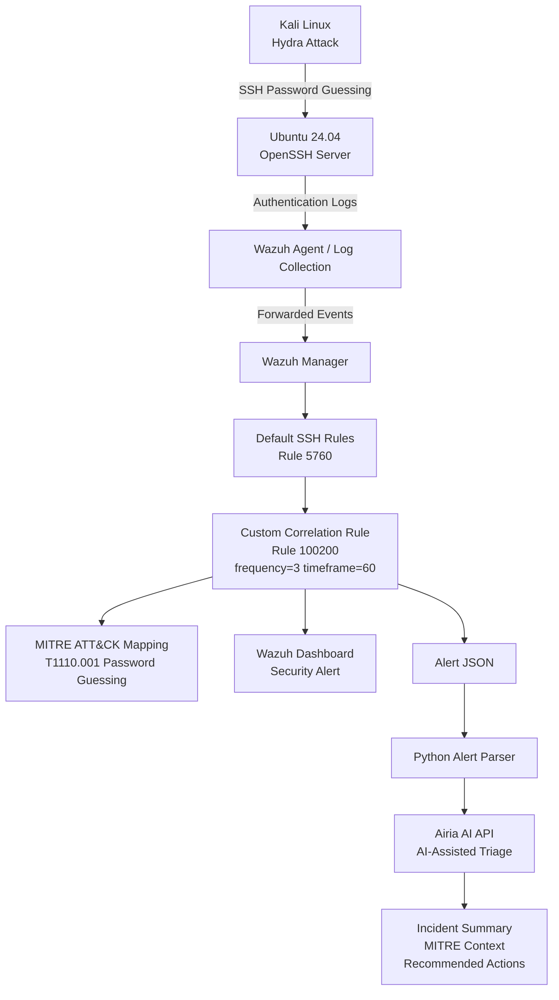

# Wazuh Detection Engineering Lab with AI-Assisted Incident Analysis


## Overview

This repository is a hands-on Detection Engineering lab built around Wazuh.
Each lab simulates a real attack technique, builds a custom Wazuh detection
rule for it, maps it to MITRE ATT&CK, and documents the full analyst
workflow: attack simulation, detection logic, threshold tuning, false
positive analysis, and incident write-up.

An optional AI-assisted layer is included to help explain generated alerts
in plain language. **This project is not an "AI SOC platform."** Wazuh is
the detection engine; the AI component only reads alerts that Wazuh already
produced and adds a short, human-readable explanation on top.

## Project Goals

- Practice building and tuning custom Wazuh detection rules
- Map detections to MITRE ATT&CK tactics/techniques
- Document a realistic analyst workflow (attack -> detection -> tuning -> FP analysis)
- Explore how an AI assistant can support (not replace) triage

## Architecture



See [`architecture/`](architecture/) for diagrams and [`screenshots/`](screenshots/)
for Wazuh dashboard captures.

## Featured Lab: T1110.001 SSH Brute Force

The first completed lab simulates an SSH password-guessing attack and
walks through the full detection engineering process.

- [Lab overview](labs/T1110-SSH-Bruteforce/README.md)
- [Attack simulation](labs/T1110-SSH-Bruteforce/attack.md)
- [Detection logic](labs/T1110-SSH-Bruteforce/detection.md)
- [MITRE ATT&CK mapping](labs/T1110-SSH-Bruteforce/mitre.md)
- [Threshold tuning](labs/T1110-SSH-Bruteforce/threshold-tuning.md)
- [False positive analysis](labs/T1110-SSH-Bruteforce/false-positive-analysis.md)
- [AI-assisted analysis](labs/T1110-SSH-Bruteforce/ai-assisted-analysis.md)

## Completed Rules

| Rule ID | Description | MITRE ID | Level |
|---|---|---|---|
| [100200](custom-rules/100200.xml) | SSH Brute Force Attack Detected | T1110.001 | 12 |

## AI-Assisted Incident Analysis

The [`ai-assistant/`](ai-assistant/) folder contains a small, self-contained
example of how a Wazuh alert can be parsed and handed off to an AI model
(Airia) for a plain-language explanation and recommended next steps. If no
AI service is configured, it falls back to a local summary - the lab works
either way. See [`ai-assistant/README.md`](ai-assistant/README.md) for setup
and usage.

## Repository Structure

```text
Wazuh-Detection-Engineering-Lab/
├── README.md
├── LICENSE
├── architecture/              # Diagrams
├── screenshots/               # Wazuh dashboard/alert screenshots
├── custom-rules/
│   └── 100200.xml             # SSH brute force detection rule
├── labs/
│   └── T1110-SSH-Bruteforce/  # Full lab: attack, detection, tuning, FP analysis
└── ai-assistant/               # Optional AI-assisted alert explanation layer
```

## Future Improvements

- Add more labs covering additional MITRE ATT&CK techniques
- Expand custom rule set beyond SSH brute force
- Add architecture diagrams and dashboard screenshots
- Improve AI-assisted analysis with more context per alert

## Disclaimer

This is a personal learning and portfolio project built in an isolated lab
environment. It is not production security tooling, and the AI-assisted
component is a simple helper layer, not an autonomous SOC or a replacement
for analyst judgment. All IPs, usernames, and logs shown are sanitized/lab
data.
