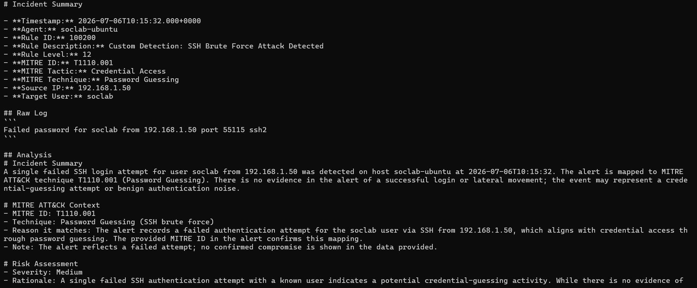
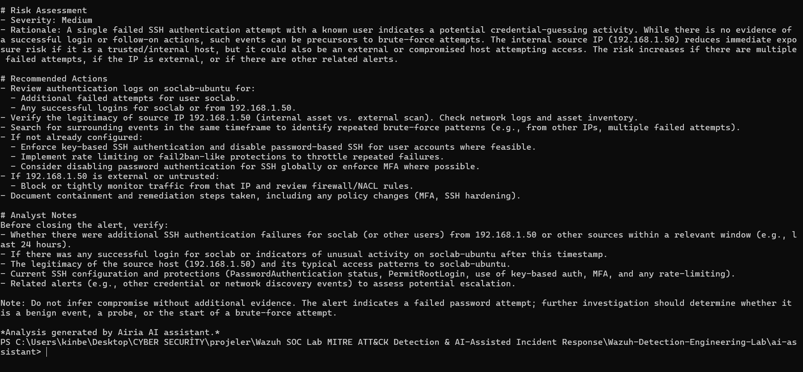

# AI-Assisted Incident Analysis

## Objective

The purpose of this component is to assist SOC analysts during the triage phase by automatically summarizing Wazuh alerts and providing contextual information.

The AI component does not replace the detection engine.

Instead, it acts as an assistant that helps analysts understand alerts more quickly.

---

# Position in the Detection Workflow

```text
Hydra Attack
        │
        ▼
Ubuntu SSH Logs
        │
        ▼
Wazuh Detection Rules
        │
        ▼
Custom Rule 100200
        │
        ▼
Alert JSON
        │
        ▼
Python Alert Parser
        │
        ▼
Airia AI API
        │
        ▼
Incident Summary
        │
        ▼
Recommended Actions
```

---

# Workflow

The AI-assisted workflow consists of four stages:

1. Wazuh generates an alert.
2. A Python parser extracts relevant alert fields.
3. The parsed alert is sent to the Airia AI API.
4. Airia returns an incident summary and recommended actions.

---

# Parsed Alert Fields

The parser extracts only the information required for incident analysis.

Example:

| Field | Example |
|--------|---------|
| Rule ID | 100200 |
| Severity | 12 |
| Source IP | 192.168.1.X |
| Target User | soclab |
| MITRE Technique | T1110.001 |
| Description | SSH Brute Force |

---

# Example AI Output

## Incident Summary

Multiple failed SSH authentication attempts were detected against the account **soclab**.

The activity is consistent with a password guessing attack targeting the SSH service.

---

## MITRE ATT&CK Context

Technique:

**T1110.001 – Password Guessing**

Tactic:

**Credential Access**

---

## Recommended Actions

- Review authentication logs.
- Verify whether the source IP is trusted.
- Check for successful logins after repeated failures.
- Consider blocking the source IP.
- Enable MFA where possible.
- Review additional authentication activity from the same host.

---

# Why AI Is Used

The AI component is designed to reduce analyst workload during initial triage.

Rather than manually interpreting every alert, analysts receive a concise explanation and suggested next steps.

Final decisions always remain with the analyst.

---

# Project Scope

This project is **not** an AI-powered SIEM.

It is a Wazuh Detection Engineering laboratory that includes an AI-assisted incident analysis component.

Detection is performed by Wazuh.

AI is used only to improve incident understanding and triage efficiency.

---

# Lessons Learned

AI can improve the speed of incident triage by providing contextual explanations and investigation guidance.

However, accurate detection still depends on well-designed detection rules and properly tuned thresholds.

---

# 🖼 Screenshots

Real terminal output of `report_generator.py`, showing the live Airia AI response for the rule `100200` alert:




