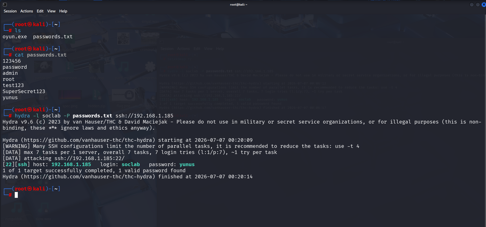

# Attack Simulation

## Objective

The objective of this step is to simulate an SSH password guessing attack against a dedicated test user on an Ubuntu server.

This attack is used to generate authentication failure events that can be collected and analyzed by Wazuh.

## Attack Scenario

| Field | Value |
|---|---|
| Attacker | Kali Linux |
| Target | Ubuntu 24.04 SSH Server |
| Target IP | Ubuntu-Server-IP |
| Target User | soclab |
| Attack Tool | Hydra |
| Technique | SSH Password Guessing |
| MITRE ATT&CK | T1110.001 |

## Password List

A small custom password list was used for controlled testing.

The list contained 7 test passwords.  
The correct password was intentionally placed as the 7th entry.

This approach was chosen to:

- keep the lab controlled
- generate multiple failed login attempts
- verify detection after repeated authentication failures
- avoid unnecessary brute-force traffic

Example:

```text
password1
admin123
welcome1
test123
qwerty123
soc2024
<correct-password>
```

## Screenshot


