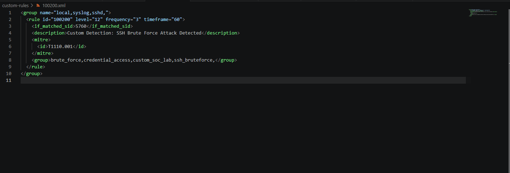
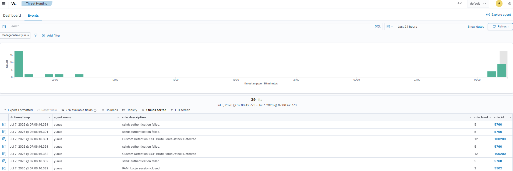
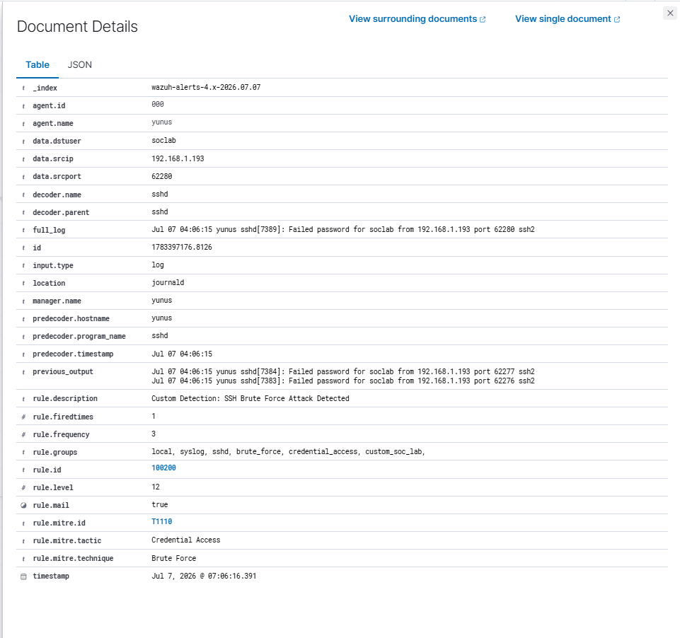

# Detection Engineering

## 🎯 Objective

The purpose of this lab is to understand how repeated SSH authentication failures can be transformed into meaningful security detections using Wazuh.

Rather than detecting every failed login attempt individually, the goal is to identify behavior that is more likely to represent a brute-force attack.

---

# 🔍 Understanding the Detection Process

Every SSH authentication attempt generates log events on the Ubuntu server.

These events are collected by the Wazuh Agent and forwarded to the Wazuh Manager, where they are decoded, matched against detection rules, and converted into security alerts.

The detection workflow consists of three stages:

1. Log Collection
2. Rule Matching
3. Alert Generation

---

# 📄 Raw SSH Authentication Logs

Example SSH authentication failure:

```text
Failed password for soclab from <Attacker-IP> port 55115 ssh2
```

This log contains several important fields:

| Field | Description |
|---------|-------------|
| Username | Target account |
| Source IP | Attacker IP |
| Port | Source connection port |
| Result | Authentication failed |

These values become available to Wazuh after decoding.

---

# 🛡 Default Wazuh Detection

By default, Wazuh detects individual SSH authentication failures.

Example:

Rule ID

5760

Description

```
sshd: authentication failed
```

Each failed login attempt generates an alert.

This provides visibility into authentication activity but does not necessarily indicate malicious behavior.

---

# ⚠ Why Default Detection Is Not Enough

A single failed login attempt is common in production environments.

Examples include:

- User typed the wrong password
- Expired credentials
- Incorrect SSH client configuration
- Automation scripts using outdated passwords

Generating high-severity alerts for every failed login would create excessive alert noise and increase false positives.

---

# ⚙ Custom Detection Engineering

To improve detection quality, a custom correlation rule was developed.

Instead of reacting to a single failed login, the rule identifies multiple authentication failures occurring within a defined time window.

This approach increases confidence that the observed behavior is malicious rather than accidental.

---

# 📊 Detection Workflow

```text
SSH Authentication Failure

        │

        ▼

Default Rule 5760

        │

        ▼

Multiple Failed Events

        │

        ▼

Custom Rule 100200

        │

        ▼

MITRE ATT&CK Mapping

        │

        ▼

Security Alert
```

---

# ✅ Detection Result

The custom detection successfully identified repeated SSH authentication failures generated during the Hydra attack simulation.

Observed alert:

| Field | Value |
|---------|-------------|
| Rule ID | 100200 |
| Severity | 12 |
| MITRE Technique | T1110.001 |
| Detection | SSH Brute Force |
| Target User | soclab |

---

# 💡 Detection Engineering Notes

The objective of this detection is not simply to generate alerts.

The objective is to improve detection fidelity by identifying repeated authentication failures that are more likely to represent brute-force activity.

Future improvements may include:

- Source IP correlation
- Username correlation
- Successful login correlation
- Alert deduplication
- Threat hunting dashboards

---

# 📚 References

- MITRE ATT&CK T1110.001
- Wazuh Documentation
- OpenSSH Authentication Logs

---

# 🖼 Screenshots

Custom rule definition (`custom-rules/100200.xml`):



Wazuh events overview showing the correlation from default rule `5760` to custom rule `100200`:



Alert detail for the triggered `100200` alert:


